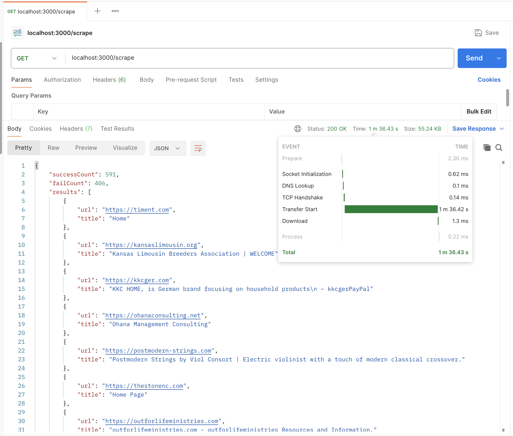
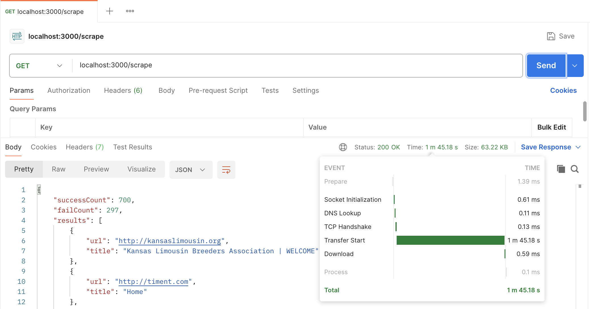
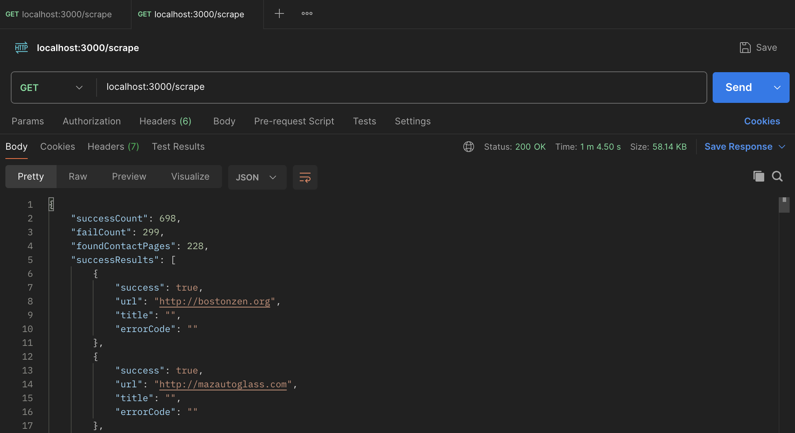

# veirdion-task

### API endpoints:

    GET /hello -> Greeting you back :D
    GET /scrape -> Scrapes the websites in the sample-websites.csv file and returns the titles of the websites

### Project config, dependencies and environment:

- Macbook Pro M1 Pro, 10 cores, 16GB RAM
- Node.js (v20.9.0) with Typescript | Express.js | Axios -> standard project config
- Cheerio -> parsing and manipulating HTML
- p-limit -> limit the number of concurrent promises

## Step 1:

First thing was to create the base of the project, add the middlewares to make it
simpler to work with and test all libs work as expected.

To start the Step 1 scraping process, firstly I tried a dummy solution to get
a starting reference point and see how things improve over iterations.

In this dummy solution, I created an end **/scrape** endpoint that hits all the websites
in the **sample-websites.csv** file, parses and returns all the titles of all the website
with the success and fails count.

With initial config values :

- having HTTPS,
- 20 concurrent requests and 20 seconds timeout to read
- Headers to make the requests look like it originated from a browser

And the results are at almost **60% success rate in 1 minute 37 seconds**.

But having the same config with HTTP instead of HTTPS, we jump to **70% success rate in 1m 45s**

Given that I won't do any operations that require sensitive data, I will keep the HTTP version.

##### Having all this validated, and with the dummy solution working, I can now start the real searching for the data needed for the scraping task. My main objectives for now are:

- Group the errors by their type in <ins>failed_requests_log.txt</ins>, understand why they fail and find how I can
  reduce
  the fail rate.
- Look at tge successes, find if they have the data I'm interested in
  ( phone numbers, social media links, address / location ) directly in the homepage.
- Try to hit as many relevant pages as possible, decide on how to handle about-us/contact pages.
- See if locales are relevant to this set of websites, and if I need to handle them differently.

##### Grouping Errors we have:

- getaddrinfo ENOTFOUND: 187 errors
    - This is a DNS resolution error, the domain is not found. I tried to change my DNS to google/cloudfare's but to no
      results.
- ERR_BAD_REQUEST: 64 errors of 404's, not much to do here, the website is not found.
- ECONNABORTED: 11 errors, i might increase the timeout a little, maybe we can hit a few of these
- Security & certificate issues : around 10 errors
- Rest of errors: Around 20 are caused by me, I hit the server one too many times and got blocked.
  I will change my network to see if I can bypass it and raise a bit the hit rate. An alternative would be a list of
  proxy or a VPN that would alternate between runs, but in this case it doesn't seem to be worth it.

### Parsing the data

Here comes the interesting part, parsing the data to get the data I'm interested in.
I think we need to start with initial assumptions and see how we can build upon it :

- Firstly, the footer usually has the contact info we're interested in, so we already have a good starting point
- Secondly, the contact page is the place where these informations have to be, so we can target it directly after
  parsing the landing page
- Thirdly, if a contact page is missing, maybe there is an about-us page that has the info we need

Now, a simple approach to finding the contact page is to use the landing page, that we already have parsed
and find a hyperlink to that page, trying to match variations of the word **contact** in the href using a simple Regex.

An alternative approach is to use the sitemap.xml, a similar approach, but it requires extra calls and is not guraatned
to exist,
given we win by not parsing the landing page and just the sitemap we lose by complexity. Maybe use it later as
a fallback.

Of course, the main issues now is that not all the websites are in english, and not all are localized.
We can start with just words in english, the results are :

Managed to get 228 contact pages, keeping the success rate at 70%, but slashing the time to 1 minute, 4 s.

I did that by optimizing the concurrent requests to be **3 x number of CPU's ( 24 in my case )**,
and closing other thread hungry processes, so no more Spotify for me while waiting for the results.

##### Next, I will decide on the phone number, social media and address Regex.

I want to hit the landing page and the contact page with them, maximizing the chances of getting the data.

- Phone number: I will use a simple regex that matches the most common phone number formats : up to 13 digits, ( 1
  special chars, 2 for country code , 10 for the number ) with optional spaces, dashes, brackets and the country code.

334 phone numbers found, not bad.

